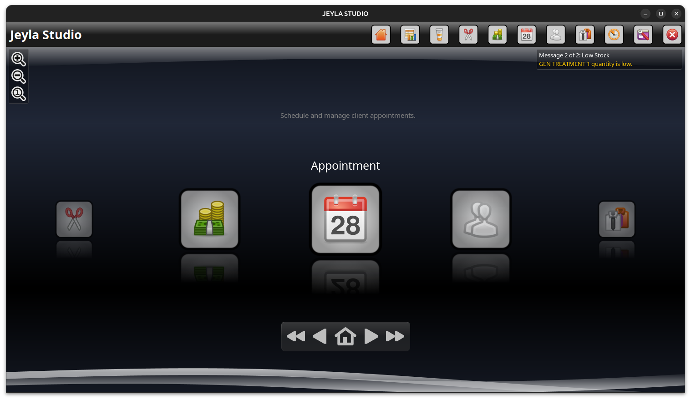
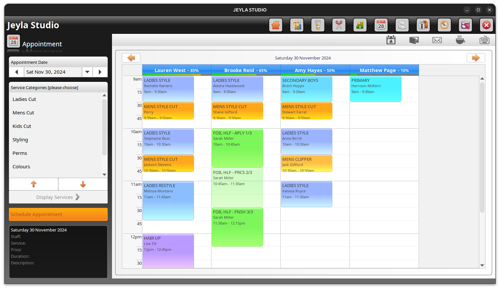
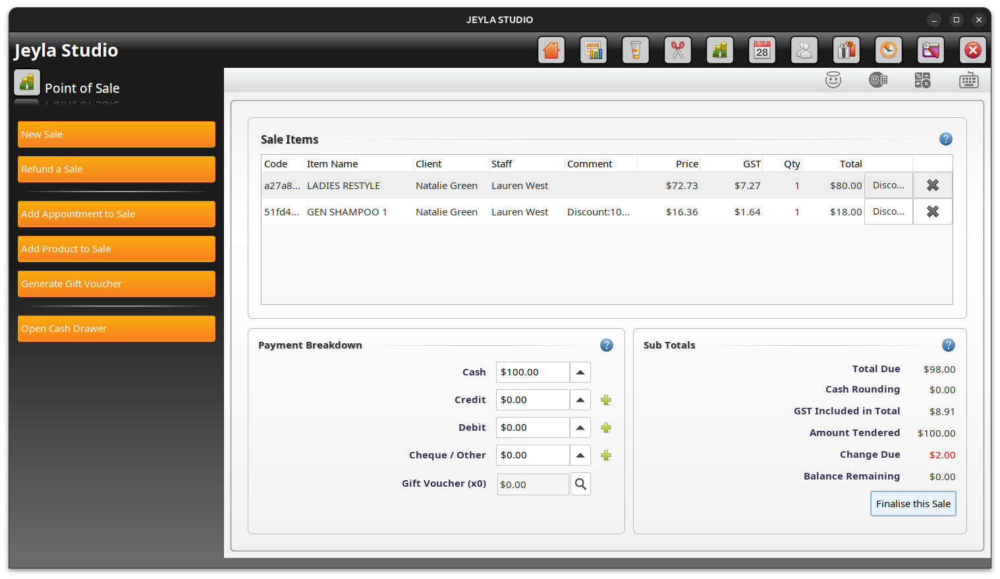
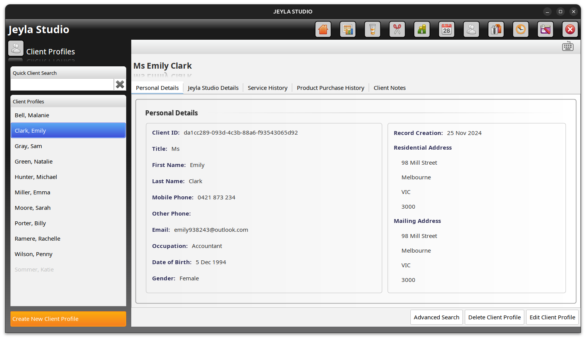
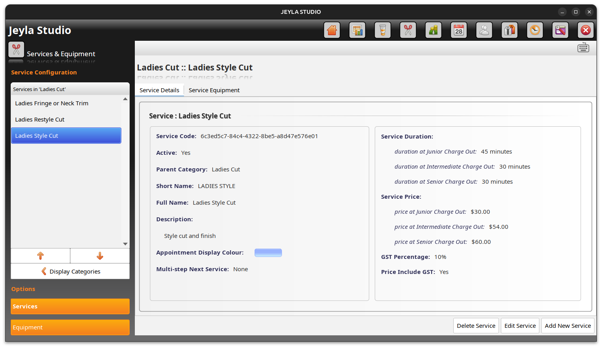
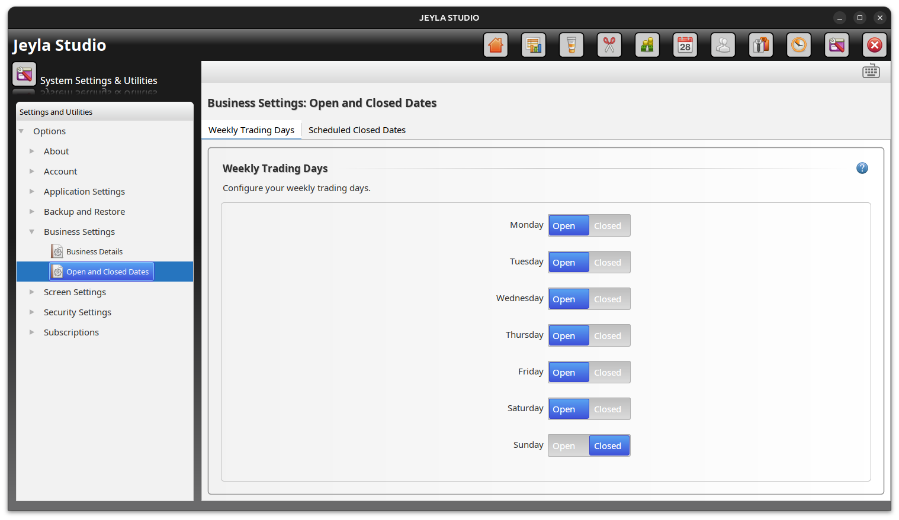

<div id="jeylastudio-logo" align="center">
    <br />
    
    <h1>Jeyla Studio Salon Software</h1>
    <h3>Free Salon Management Software</h3>
</div>

## <a id="download-install"></a>Download/Install

:tada: :tada: [Download latest release here](https://github.com/jeylastudio/salonsoftware/releases) :tada: :tada:

> **Note:**
> macOS users will need to execute this command (only once) in a terminal window before running Jeyla Studio:
```cmd
xattr -r -d com.apple.quarantine /Applications/JeylaStudio.app
```

## <a id="about"></a>About
Jeyla Studio is a fully featured salon management application. Features include appointment scheduling, service management, product management, client management, staff management, point of sale and extensive reporting functionality.














